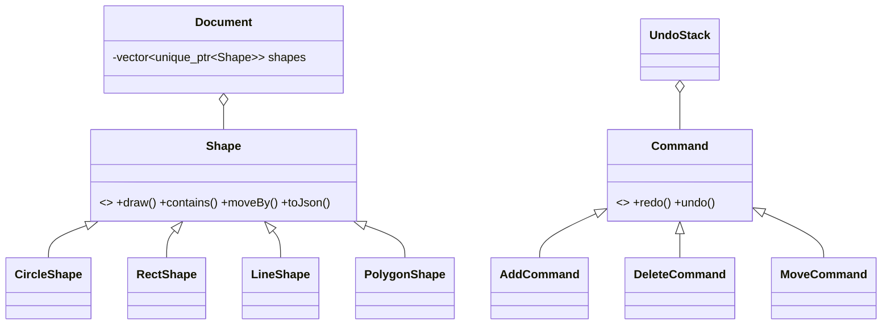

# VectorForge

A 2D vector drawing editor written in C++17 with Qt 6. Draw shapes, move them,
undo and redo every action, save and load drawings as JSON, and select shapes
quickly in large scenes with a Quadtree spatial index.


## Features

- Draw circles, rectangles and lines by dragging on the canvas
- Select, move and delete shapes (dashed outline on the selected shape)
- Unlimited undo/redo (Ctrl+Z / Ctrl+Y) for add, delete and move
- Save and open drawings as JSON; corrupt files are rejected without losing the current drawing
- Quadtree hit-testing, benchmarked against a linear scan
- [N] unit tests

## Design

| Concept | Where it is used |
|---|---|
| Polymorphism, abstract base class | `Shape` and `CircleShape`, `RectShape`, `LineShape`, `PolygonShape` |
| Command pattern | `AddCommand`, `DeleteCommand`, `MoveCommand`, `UndoStack` |
| Factory pattern | `ShapeFactory` builds shapes from JSON |
| Smart pointers | `Document` owns shapes via `std::unique_ptr`; commands take ownership of deleted shapes |
| Spatial index | `Quadtree` used by `Document::shapeAt` |



## Benchmark

Hit-testing with a Quadtree vs a linear scan (Release build, `std::chrono`,
2,000 random queries per size, fixed seed). The Quadtree returned the same shape
as the linear scan in every query (0 mismatches).

| Shapes | Linear (µs/query) | Quadtree (µs/query) | Speedup |
|---|---|---|---|
| 1,000 | 8.08 | 0.30 | 27× |
| 10,000 | 80.53 | 1.15 | 70× |
| 50,000 | 432.43 | 4.88 | 89× |

Limits: shapes were uniformly random (the Quadtree's best case), only circles and
rectangles were tested, and the index is rebuilt after each edit. Raw output is in
[docs/benchmark.txt](docs/benchmark.txt).

## Build (Windows, MSYS2 UCRT64)

```
pacman -S --needed mingw-w64-ucrt-x86_64-toolchain mingw-w64-ucrt-x86_64-cmake mingw-w64-ucrt-x86_64-ninja mingw-w64-ucrt-x86_64-qt6-base
cmake -S . -B build -G Ninja
cmake --build build
./build/VectorForge.exe
./build/UnitTests.exe
```

For the benchmark, use a Release build:

```
cmake -S . -B build-release -G Ninja -DCMAKE_BUILD_TYPE=Release
cmake --build build-release
./build-release/Benchmark.exe
```

## Controls

| Action | How |
|---|---|
| Draw | Choose Circle, Rectangle or Line, then drag |
| Select / move | Choose Select, click a shape, drag |
| Delete | Select a shape, press Delete |
| Undo / Redo | Ctrl+Z / Ctrl+Y or the toolbar buttons |
| Save / Open | Toolbar buttons |

## Roadmap

Polygon tool, Bezier curves, SVG export, incremental Quadtree updates.